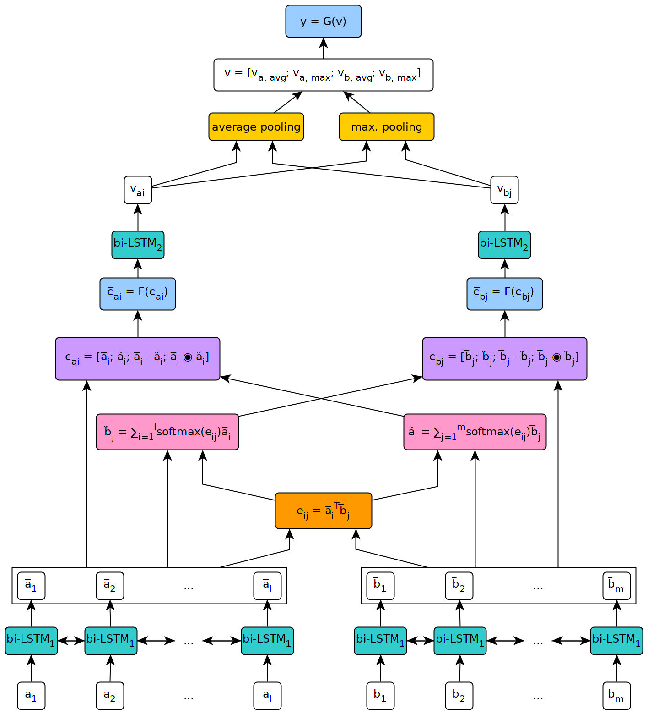
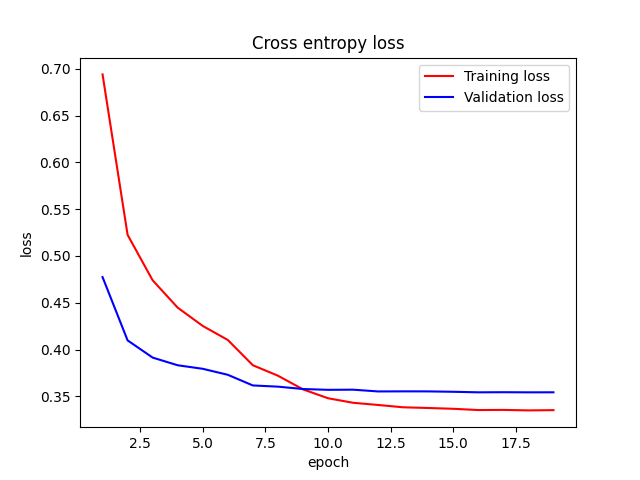

# nlpbeginner

This is a repository for my begining of NLP learning

[toc]

## Resources

[leerumor/nlp_tutorial: NLP超强入门指南，包括各任务sota模型汇总（文本分类、文本匹配、序列标注、文本生成、语言模型），以及代码、技巧 (github.com)](https://github.com/leerumor/nlp_tutorial)

## 1. Text Classification

### 词袋模型、N-Gram

最终训练效果

## 2. Text Classification with Pytorch

- CNN的文本分类

  *Convolutional Neural Networks for Sentence Classification* 的复刻

  

  

  1-嵌入层：

  ​	n*k：n个词语，每个词语是k维向量(word2vec、glove)

  

  2-卷积层

  ​	采用二维卷积核（sequence length * embedding size）即h*k, h自行设定，类似N-gram

  

  3-池化层

  ​	采用最大池化，减少特征数量

  

  4-全连接层

  ​	softmax分类

  

- RNN的文本分类

  

- word embedding初始化

- 随机embedding初始化

- glove与训练的embedding初始化

## 3 文本匹配+Attention

1. 对输入的两个句子a，b，采用双向LSTM进行编码
2. 对两句话进行alignment：
   - 先计算相似度矩阵$e_{ij}$
   - 接着计算soft-alignment-Attention,生成二者相似度加权后的句子
   - 最后通过点积-作差的方式，得到二者的差异性
3. 使用BiLSTM提取上下文信息，并作最后的比对

- 训练结果

​		准确度 19epoches 86.6592%

​		
